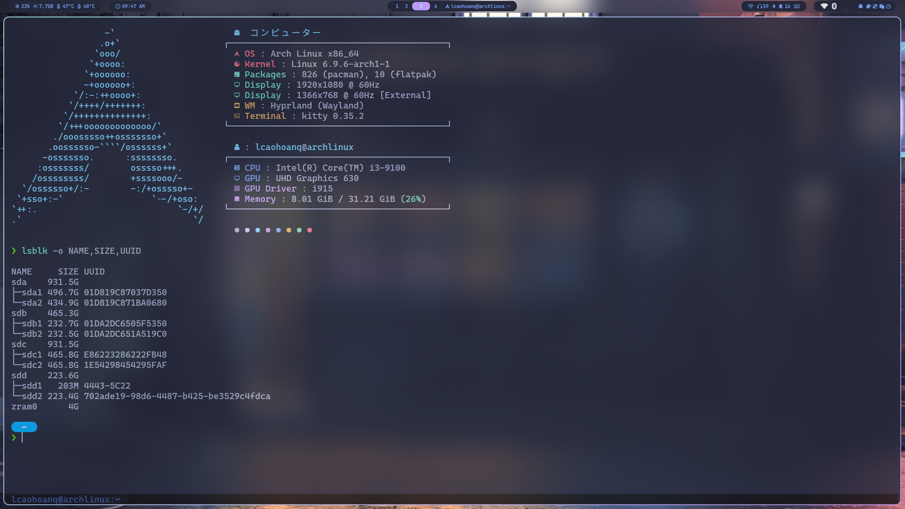

# [Mount drive]

## 1. Install G-Parted

- Debian

```bash
sudo apt install gparted
```

- Arch

```zsh
sudo pacman -S gparted
```

## 2. Get the drive's UUID

```bash
lsblk -o NAME,SIZE,UUID
```



- Or more details

```bash
sudo blkid
```

- Each UUID corresponding for each partion of each driver

## 3. Check your drive's type (NTFS,ext4,...)

- Install `ntfs-3g `, as it is required for mounting `NTFS` partitions with read and write access

```bash
sudo apt update
sudo apt install ntfs-3g
```

- If ext4, skip to the next step

## 4. Edit /etc/fstab

```bash
sudo nano /etc/fstab
```


- This is my current disk

  > /dev/sdc1: UUID="022D-A728" BLOCK_SIZE="512" TYPE="vfat" PARTUUID="10eb9e0a-d35b-4a06-add6-5af9648660de"

  > /dev/sdc2: UUID="61d23e9c-361e-4c0f-9813-ba446759b712" BLOCK_SIZE="4096" TYPE="ext4" PARTUUID="40ff6c17-e76d-4925-8dc8-4730a8ff2996"

  > /dev/sdc3: UUID="0734bbed-9e19-4d56-bd5a-5ed1e81bbaf3" TYPE="swap" PARTUUID="cf63ed80-df79-47fa-bfda-9602602118b5"

- I want to mount as ntfs with read and write partition
- Replace the UUIDs with those of your NTFS partitions and the mount points with the ones you created

```bash
# NTFS partition 1
UUID=xxxxxxxx-xxxx-xxxx-xxxx-xxxxxxxxxxxx /mnt/ntfs1 ntfs-3g defaults,rw 0 2

# NTFS partition 2
UUID=yyyyyyyy-yyyy-yyyy-yyyy-yyyyyyyyyyyy /mnt/ntfs2 ntfs-3g defaults,rw 0 2

# ext4 partition 3
UUID=yyyyyyyy-yyyy-yyyy-yyyy-yyyyyyyyyyyy /media/data  ext4  defaults  0  2
```

- /mnt/ntfs1, /mnt/ntfs2: mount point (can be create manually or auto with
- ntfs-3g: type partition

The defaults option is a shorthand that refers to a set of default mount options:

    rw (read-write)
    suid (allow set-user-identifier or set-group-identifier bits to take effect)
    dev (interpret character or block special devices on the filesystem)
    exec (allow execution of binaries)
    auto (can be mounted automatically with the mount -a command)
    nouser (only root can mount)
    async (all I/O to the filesystem should be done asynchronously)

rw

The rw option explicitly specifies that the filesystem should be mounted with read and write permissions.
0

This is the dump frequency. It is used by the dump command to determine which filesystems need to be dumped (i.e., backed up). A value of 0 means that the filesystem will not be dumped.
2

This is the fsck order. It specifies the order in which filesystem checks are done at boot time by the fsck utility:

    0 means the filesystem is not checked.
    1 is used for the root filesystem.
    2 means the filesystem will be checked after the root filesystem, with multiple filesystems having the same number being checked in parallel.


## 5. Apply change

```bash
# apply without rebooting
sudo mount -a
# If meet any error about no mount directory found, just need to reboot

# verify mounting
df -h
```

```bash
# or (sudo apt install duf) for more colorful ^^
duf
```


